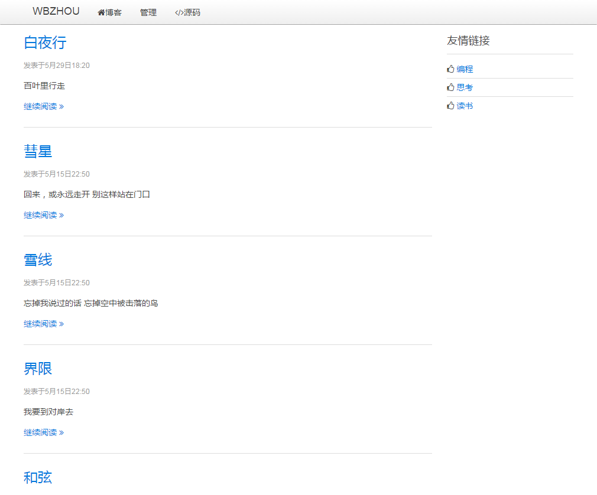
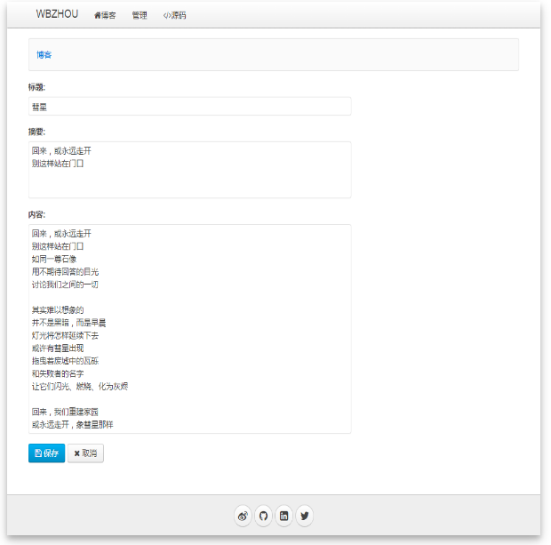
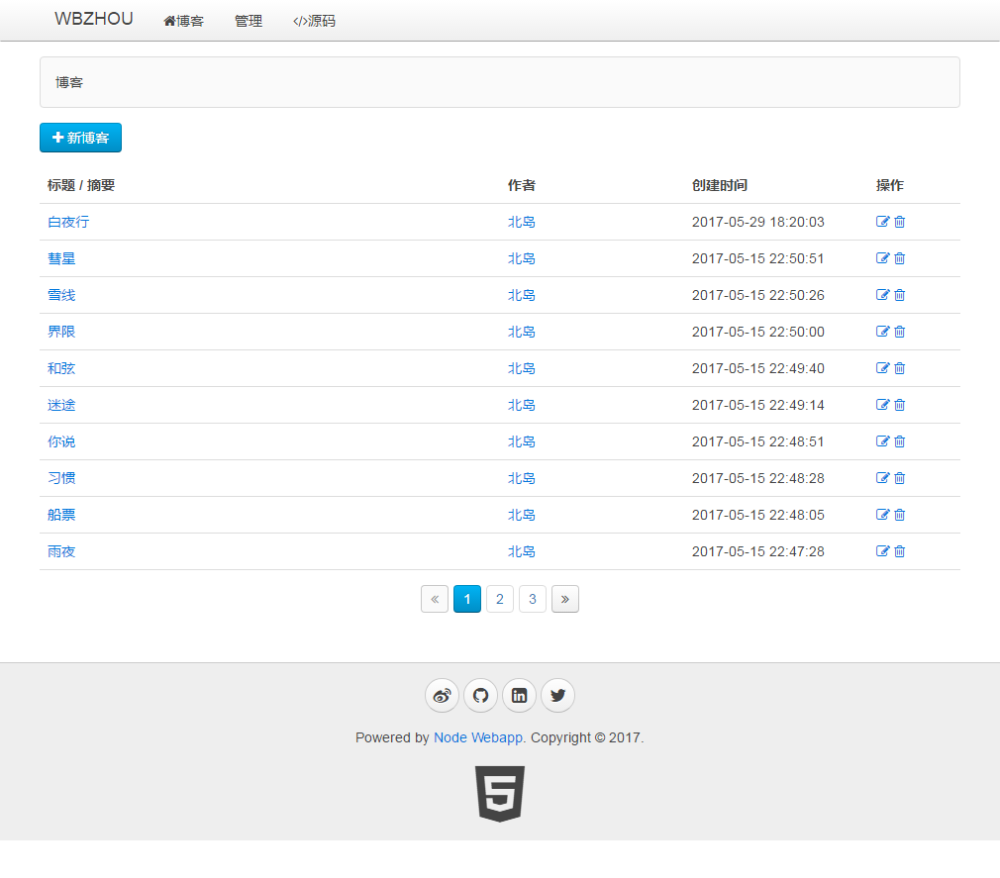
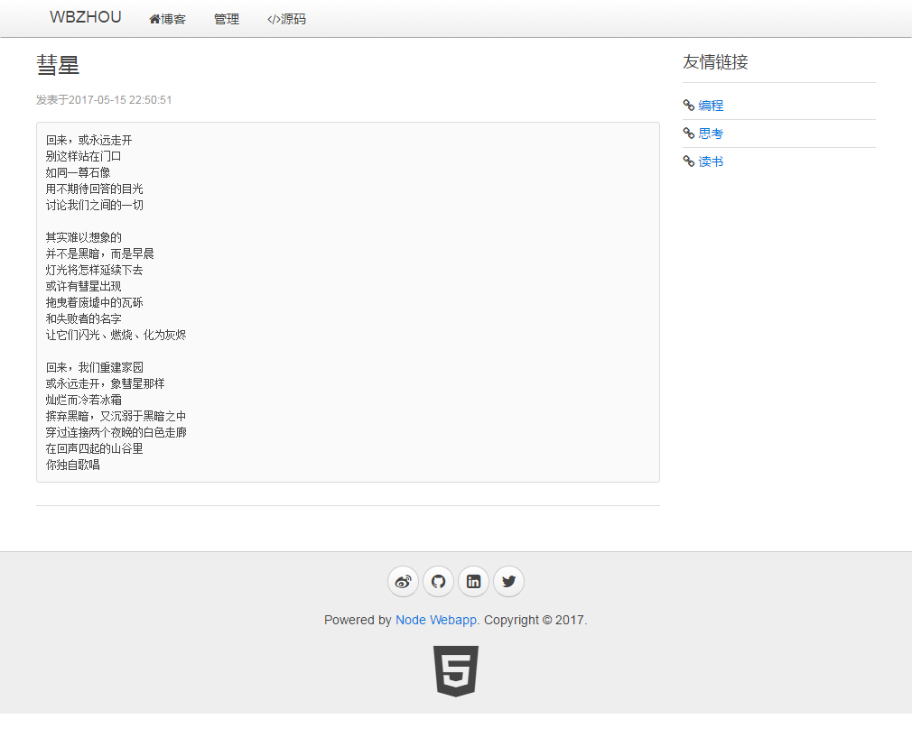

环境

* Node.js 7.9.0
* MySQL

数据库

`node init-db.js`

克隆远程库

`git clone https://github.com/wbzhou1992/Node-Blog.git`

进入项目目录

`cd Node-Blog`

安装依赖

`npm install`

运行服务器

`node app.js`

功能
- [x] 博客创建
- [x] 博客删除
- [x] 博客更新
- [x] 博客分页
- [ ] 用户登录
- [ ] 用户评论

[
[
[
[
